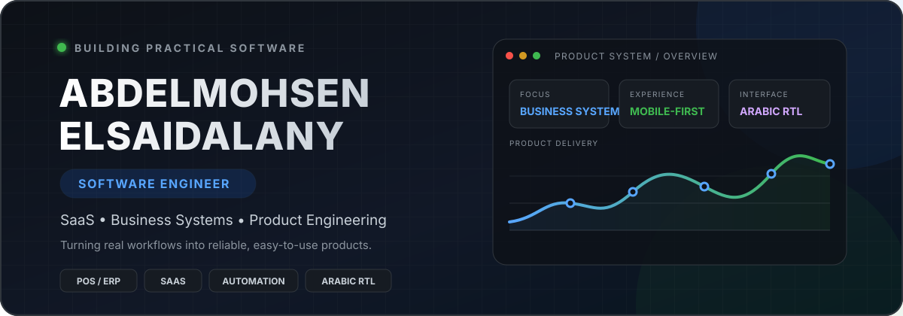

  

  <strong>Software Engineer • SaaS &amp; Business Systems Builder</strong> 
  Product thinking, reliable business logic, clean data flows, and interfaces people can actually use.

  
  
  
  

## About me

I’m Abdelmohsen, a software engineer focused on turning real business workflows into practical, reliable web products. I work across product logic, database design, dashboards, user experience, and deployment—with a strong focus on Arabic-first and mobile-first systems.

- Building SaaS products and operational business platforms
- Designing clear workflows for sales, inventory, memberships, education, and coaching
- Translating complex business rules into dependable backend behavior
- Developing product work through **Eyan Business Solutions**

> أحوّل إجراءات العمل المعقدة إلى منتجات ويب عملية، واضحة، وسهلة الاستخدام.

## What I build

<table>
  <tr>
    <td width="50%" valign="top">
      <h3>Business Systems</h3>
      
POS, ERP, inventory, purchasing, sales, costing, returns, payments, and reporting workflows built around real operations.

    </td>
    <td width="50%" valign="top">
      <h3>SaaS Products</h3>
      
Subscription-based platforms with roles, permissions, multi-user workflows, product tiers, and scalable data models.

    </td>
  </tr>
  <tr>
    <td width="50%" valign="top">
      <h3>Arabic-First UX</h3>
      
Mobile-first interfaces, complete RTL behavior, practical dashboards, printable documents, and accessible daily workflows.

    </td>
    <td width="50%" valign="top">
      <h3>Automation &amp; Data</h3>
      
Tools that reduce repetitive work, improve data accuracy, connect processes, and turn operational data into useful decisions.

    </td>
  </tr>
</table>

## Selected product work

<table>
  <tr>
    <td width="50%" valign="top">
      <h3>CMB POS &amp; ERP</h3>
      
Arabic-first business system for sales, purchasing, inventory, returns, costing, permissions, and financial operations.

    </td>
    <td width="50%" valign="top">
      <h3>Hero Gym</h3>
      
Gym operations platform for memberships, subscription plans, QR attendance, payments, and member management.

    </td>
  </tr>
  <tr>
    <td width="50%" valign="top">
      <h3>Coach Flow</h3>
      
SaaS workspace for online coaches to manage clients, training, nutrition, progress tracking, history, and communication.

    </td>
    <td width="50%" valign="top">
      <h3>EduCenter OS</h3>
      
Management platform for students, groups, subscriptions, attendance, payments, and education-center operations.

    </td>
  </tr>
</table>

Selected systems are private or commercial product work; descriptions focus on product scope rather than client-sensitive implementation details.

## Engineering toolbox

  
  
  
  
  
  
  
  
  
  

**Product &amp; architecture:** SaaS architecture • database design • RBAC • business-rule modeling • REST APIs • PWA • responsive UI • Arabic RTL

## How I work

1. Understand the real workflow before designing the screen.
2. Define business rules and the source of truth for every value.
3. Keep frontend behavior, backend logic, and database state aligned.
4. Build mobile-first, test real user paths, and make deployment repeatable.
5. Prefer useful simplicity over features that add operational noise.

## GitHub activity

  

  

---

  <strong>Build for people. Design for operations. Ship with clarity.</strong>

