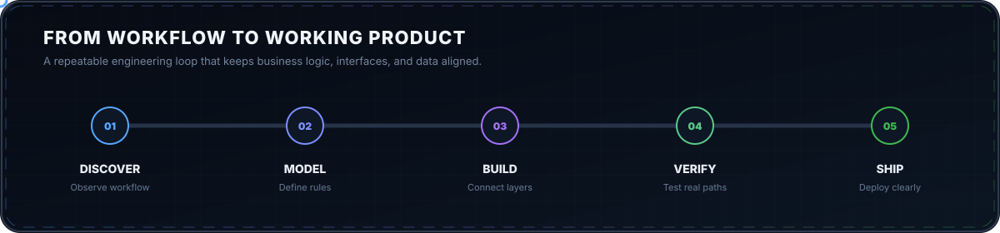

  

  <strong>Software Engineer building SaaS products and operational business systems.</strong> 
  Product logic • Data integrity • Arabic-first UX • Reliable delivery

## Engineering profile

I’m Abdelmohsen, a software engineer focused on turning complex, real-world operations into clear and dependable software. I work across product discovery, business-rule design, databases, frontend experience, backend behavior, and deployment through **Eyan Business Solutions**.

<table>
  <tr>
    <td width="50%" valign="top">
      <h3>What I build</h3>
      
SaaS platforms, POS/ERP systems, membership products, education platforms, automation tools, and data-driven operational software.

    </td>
    <td width="50%" valign="top">
      <h3>What I optimize</h3>
      
Clear business rules, trustworthy data, fast daily workflows, role-aware access, mobile-first layouts, and complete Arabic RTL experiences.

    </td>
  </tr>
</table>

> أحوّل إجراءات العمل المعقدة إلى منتجات ويب عملية، واضحة، ويمكن الاعتماد عليها يوميًا.

## Selected product systems

  

  
<strong>Product scope</strong>

   
  <ul>
    <li><strong>CMB POS &amp; ERP:</strong> sales, purchasing, inventory, costing, returns, permissions, and financial operations.</li>
    <li><strong>Hero Gym:</strong> memberships, subscriptions, QR attendance, payments, and member operations.</li>
    <li><strong>Coach Flow:</strong> client management, training, nutrition, progress, history, and coach-client communication.</li>
    <li><strong>EduCenter OS:</strong> students, groups, subscriptions, attendance, payments, and education-center workflows.</li>
  </ul>

## Tech ecosystem

  

## Product engineering workflow

  

### Engineering principles

- Understand the real workflow before designing the screen.
- Define the source of truth for every business value.
- Keep frontend behavior, backend logic, and database state aligned.
- Test complete user paths—not isolated screens.
- Prefer useful simplicity over operational noise.

## Live contribution activity

  

---

  <strong>Build for people. Design for operations. Ship with clarity.</strong> 
  Egypt • Eyan Business Solutions

